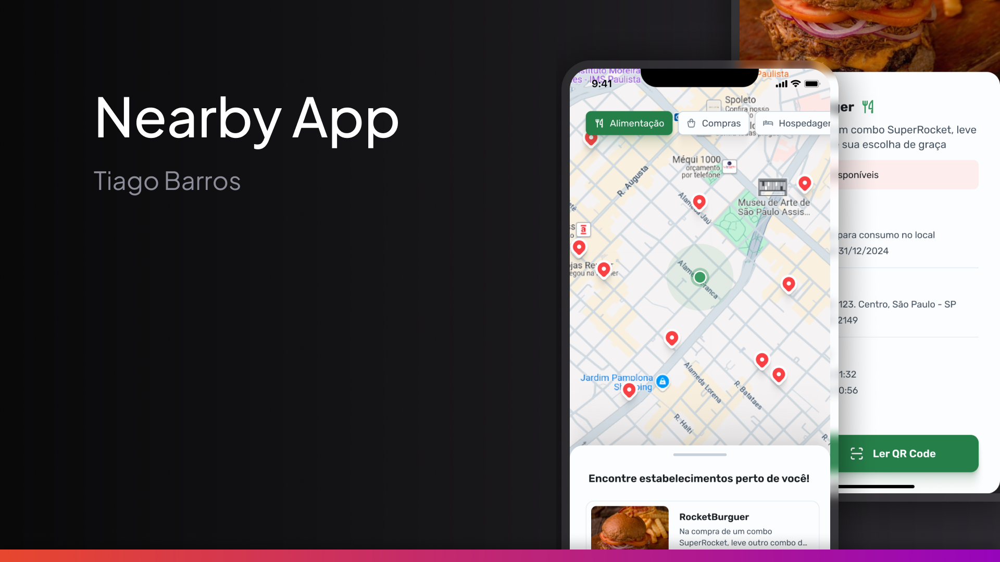

<h1 align="center"> 📍 Nearby - Benefits Club </h1>

<p align="center">
  <a href="#-tecnologias">Technologies</a>&nbsp;&nbsp;&nbsp;|&nbsp;&nbsp;&nbsp;
  <a href="#-projeto">Projects</a>&nbsp;&nbsp;&nbsp;|&nbsp;&nbsp;&nbsp;
  <a href="#memo-licença">License</a>
</p>

<p align="center">
  
</p>

<br>

<p align="center">
  
</p>

## 🛠 Technologies  
- **React Native**  
- **Expo**  
- **TypeScript**  
- **TailwindCSS**  
- **Firebase**  

## 📌 About  
**Nearby** is a mobile application designed to connect users with nearby partner establishments, offering exclusive discount coupons.  
With a modern and user-friendly interface, users can easily discover new places and enjoy special deals.

## 🚀 How to Run  

1. Clone this repository:  
   ```bash
   git clone https://github.com/tiagobarross/NearbyApp.git

2. Navigate to the project folder
    ```bash
    cd NearbyApp

3. Install dependencies 
    ```bash
    npm install

4. Start development server
    ```bash
    npx expo start

## :memo: Licença

This project is licensed under the MIT License.